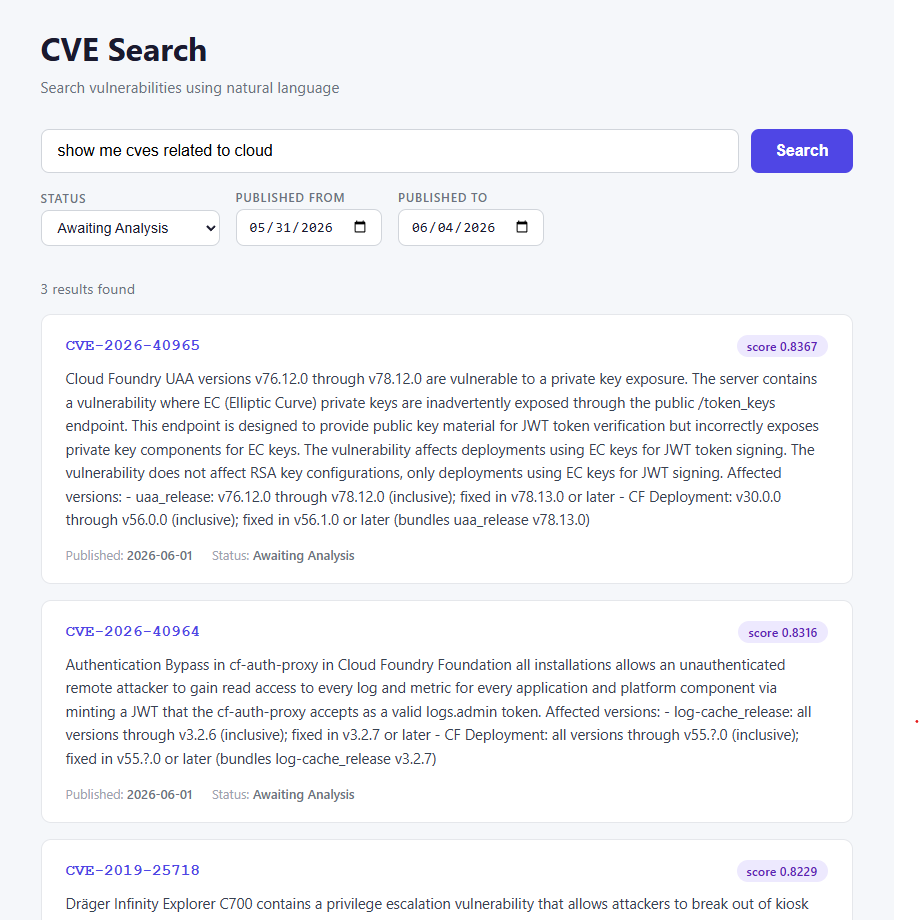

**CVE Scraper, Processor & Search**

A distributed pipeline designed to monitor, extract, store, and search vulnerability data from the National Vulnerability Database (NVD), running on a local Kubernetes cluster (Minikube).

**The system consists of four components:**

* Scraper (Python `app.py`): Polls the NVD API for new CVEs and publishes raw data to RabbitMQ. Runs as a Kubernetes Job.
* Processor (Go): Consumes messages from RabbitMQ, generates semantic embeddings for each CVE description using the Gemini embedding model, and persists the data to MongoDB Atlas.
* Query API (Python `api.py`): A FastAPI service that accepts natural language queries, converts them to embeddings using the Gemini model, and performs vector search against MongoDB Atlas to return semantically relevant CVEs. Supports optional filtering by status and published date range.
* Frontend (Next.js): A web UI for searching CVEs using natural language. Users can type a plain English query (e.g. "remote code execution vulnerabilities in Apache") and optionally filter results by CVE status and published date range.

**Deployment targets**

The same Kubernetes manifests support both Minikube and Google Cloud. Each deployment YAML contains commented lines for both targets — swap the `image` and `imagePullPolicy` fields to switch:

* Minikube: use the short image name (e.g. `go-cve`) with `imagePullPolicy: Never` so Kubernetes uses the locally built image.
* Google Cloud: use the full Artifact Registry path (e.g. `us-central1-docker.pkg.dev/<project>/my-repo/go-cve:latest`) with `imagePullPolicy: IfNotPresent`.

**Natural language search**

The search pipeline works as follows:
1. The user types a query in plain English.
2. The frontend sends the query to the Python API.
3. The API generates a 768-dimension vector embedding of the query using `gemini-embedding-2`.
4. MongoDB Atlas performs a vector search using the stored `description_embedding` field on each CVE document, returning the top 10 semantically closest matches.
5. Results are displayed as cards showing CVE ID, description, published date, status, and similarity score.
